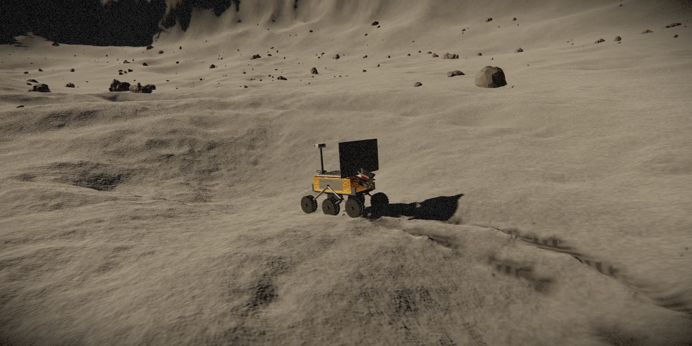
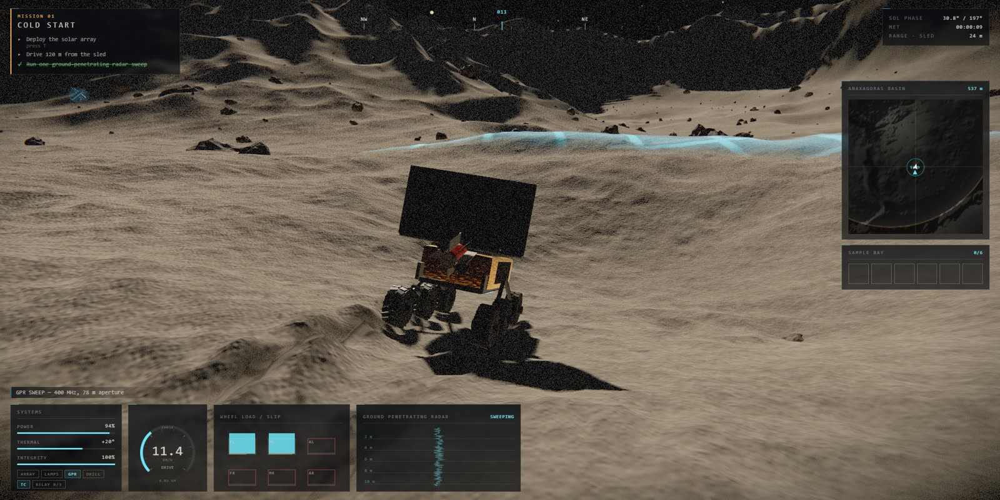
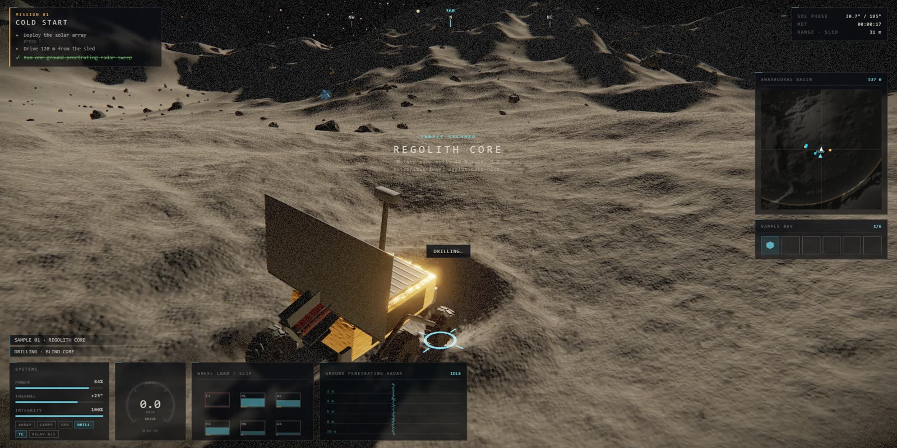
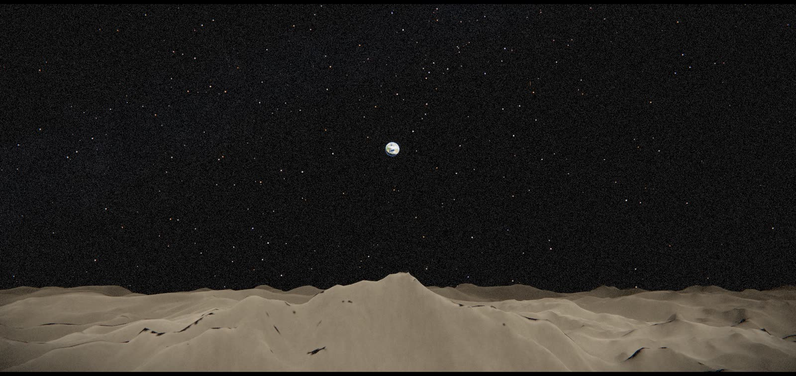
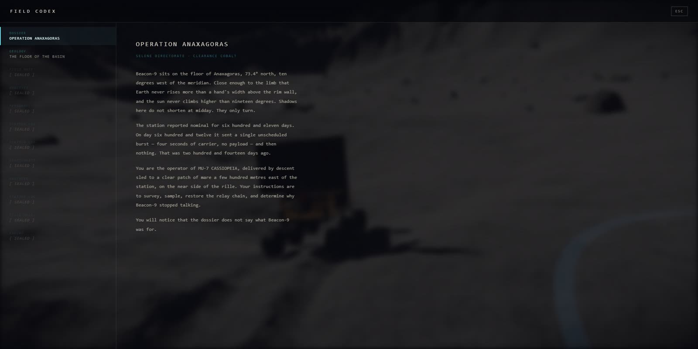
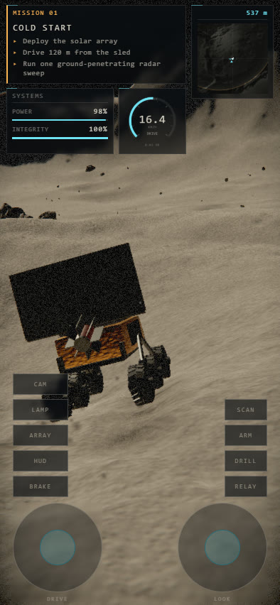
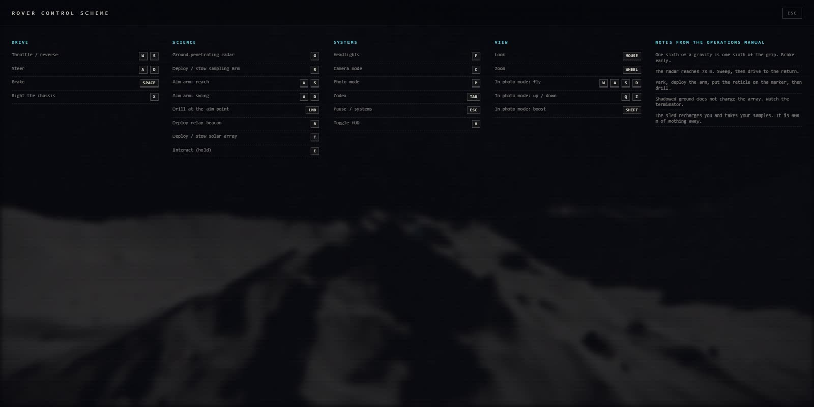

<div align="center">

# REGOLITH

### The Silence at Anaxagoras

**A lunar rover survey game that runs in a browser tab.**
No engine, no build step, no dependencies, no downloaded assets.

[](https://winchxyz.github.io/moon-rover/)
[](https://github.com/winchxyz/moon-rover/releases/download/v1.0/regolith-demo.mp4)


-1a1d24)




</div>

> Two hundred and fourteen days ago the far-side outpost **Beacon-9** sent four
> seconds of empty carrier and stopped.
>
> You operate **MU-7 CASSIOPEIA**, a 900 kg six-wheel survey rover put down by
> descent sled on the floor of Anaxagoras at 73° north. Survey the basin,
> restore the relay chain, and find out what is under the floor — and why the
> dossier does not say what the station was *for*.

---

## Look at it

|  |  |
|:--|:--|
|  <br> **Driving.** A radar sweep going out at 400 MHz. The cyan wavefront is a real query against the subsurface field, not a decal. |  <br> **Drilling.** The arm is a two-link IK chain you aim yourself. Every core comes out of the height field the wheels drive on. |
|  <br> **Earth never gets high.** At 73° north it sits 13°–16° up — from the basin floor the rim wall is in the way. That is why the relay mission exists. |  <br> **The codex** fills in as you survey. Twelve entries, most of them sealed until you have been somewhere or drilled something. |

<div align="center">


*On a phone the instrument list is cut to what you steer by, and the bottom of the screen belongs to your thumbs.*

**[▶ Watch the 28-second demo](https://github.com/winchxyz/moon-rover/releases/download/v1.0/regolith-demo.mp4)** — 1280×720, with sound.
</div>

---

## About this project

This is a toy. It started as a **single prompt** — verbatim, typos and all:

> *"Create me a fully playable release-ready game. On GPU. Game about moon
> discovery with rover with gravity, moon sand and etc.. I need it in 3D and not
> a voxel game. Make it with maximum effort, show me best what you can create.
> Use all your power, knowledge and make best graphics and best game design.
> Surprise me with graphics, lore and everything."*

That got a playable build. Everything after it came from **sixteen rounds** of
"this bit is wrong, fix it" — steering inverted, wheels floating off the
chassis, a HUD covering half a phone screen, a settings panel that had been
collapsing to a 2 px strip since the first commit. Nothing here was planned up
front. The physics constants, the photometric
model, the lore, the sound design and the layout of the instrument panel all
arrived one complaint at a time.

There are **no downloaded assets**, and the game fetches none at runtime —
not even a failed request. Every texture, every rock, every star and every
sound is generated by code at load time — partly a design constraint,
partly the reason the whole thing is ~380 KB over the wire and loads in seconds.

It is not a finished game. It *is* a real one: it has a beginning, five
missions, an ending, and a rover that will dig itself a 40 cm hole if you sit
there with the throttle down — though it can still climb out of one.

| | |
|--:|:--|
| **6,325** | lines of JavaScript in `src/` |
| **592** | lines of CSS |
| **0** | dependencies, build steps, and asset files the game loads |
| **5** | missions · **12** codex entries · **9** sample types |
| **~380 KB** | gzipped download (1.68 MB raw), including a vendored three.js |

---

## Play

**[winchxyz.github.io/moon-rover](https://winchxyz.github.io/moon-rover/)** —
that is the whole install.

Chrome, Edge, Firefox, Safari 15+, iOS 15+. Needs WebGL2. Works on phones and
tablets with twin thumbsticks. Progress autosaves to `localStorage` every 20
seconds.

### Run it locally

```bash
npm start
```

Then open <http://localhost:5173>. Any static file server works — the only
requirement is HTTP rather than `file://`, because it uses ES modules.

```bash
node server.js 8080
```

Node 18+ for the server. There is nothing to install; `npm start` just runs
`server.js`, which has no dependencies either.

### Publish your own

It is a static site with no build step, so GitHub Pages needs nothing special:
push the repo, then **Settings → Pages → Source: Deploy from a branch**, `main`
and `/ (root)`. Every path is relative, so it works from a subdirectory without
configuration.

---

## Controls

| | |
|---|---|
| `W` `S` | Throttle / reverse |
| `A` `D` | Steer — and pivot on the spot when stopped |
| `Space` | Brake |
| `X` | Right the chassis after a rollover |
| `G` | Ground-penetrating radar sweep (78 m) |
| `R` | Deploy / stow the sampling arm |
| `W` `S` `A` `D` | With the arm out: reach and swing it |
| `LMB` | Drill at the aim point |
| `B` | Deploy relay beacon |
| `T` | Deploy / stow the solar array |
| `E` | Interact (hold) |
| `F` | Headlights |
| `C` | Cycle camera · `P` photo mode |
| `K` | Save the current frame as a PNG |
| `Tab` | Field codex |
| `Esc` | Pause / systems |
| `H` | Toggle HUD |

Mouse looks, wheel zooms. Gamepads work. On phones and tablets you get twin
thumbsticks and two button groups, including `HUD` to clear the instruments off
the screen. They stack as columns beside the sticks — except on a landscape
phone, where they drop into a single row between them.



The chase camera drifts back behind the rover only after you have left the mouse
alone for about three seconds — set **CAMERA AUTO-CENTRE** to OFF under `Esc` if
you would rather it never moved on its own. **HUD SIZE** scales every instrument
panel together.

Two settings make it harder and more honest:

**DRIVE ENVELOPE** swaps the arcade profile for an LRV one: 13 km/h instead of
30, a 45-second core instead of 4, and a pack that lasts half an hour instead of
three and a half minutes. Every speed threshold in the rover, camera and audio
is a fraction of that one top-speed number, so the steering still loads up, the
camera still dollies and the motor still sounds worked — they just do it at a
real rover's pace.

The battery is the one number that is deliberately *not* realistic, and it is
worth saying why rather than fudging it quietly. An LRV pack is 8.7 kWh and
about 57 km of range; this basin is 864 m across, so a real pack would cross it
sixty-six times. Even VIPER's much smaller 450 Wh is hours. There is no honest
capacity that leaves power as a source of tension at this scale — so realistic
mode does not invent one. It slows the drain eightfold, which turns power from a
panic into planning, and moves the pressure to time, where the slow drive, the
slow drill and the signal delay already put it.

**SIGNAL DELAY** puts you where a Lunokhod driver actually sat. Drive commands
cross to the Moon and the picture comes back: 1.28 s each way, 2.56 s before you
see the rover do what you told it. Measured in-game, at LRV speed, releasing the
throttle costs you **21 m of coast instead of 11** — you brake three rover
lengths earlier than feels right, or you hit the boulder you already stopped for.
Arm aiming and the camera are deliberately not delayed; that is a playability
call, not a claim about physics, and the reasoning is in `main.js`.


---

# The technical side

Everything below is in this repository, in plain ES modules you can open and
read. The interesting parts are not the rendering tricks — they are the places
where the physics and the pixels are forced to agree.

## What is actually simulated

### One sixth of a gravity, and the consequences

1.62 m/s². The suspension is sized for **lunar** weight — 1458 N total, about
9 cm of static sag. Earth spring rates would make the rover act like a steel
bar; the first version used them and it did. Peak traction is roughly 1250 N,
so the rover accelerates at about 1.3 m/s² and lets go of the surface long
before you expect it to.

### Wheels, not a capsule

A rigid body with a real inertia tensor and six raycast wheels, each with
spring-damper suspension, slip-based tyre forces inside a friction circle, and
pressure-based sinkage — a saturating linear model, not a true Bekker
pressure-sinkage curve. Contact pressure over the bearing strength of the top
few centimetres of regolith (~12 kPa) gives 1–2 cm of sink at static load and
about 6 % of weight in rolling resistance, which is roughly what Apollo
measured.

The wheel-spin integration is solved **semi-implicitly**, because the hub's
inertia is tiny next to the slip stiffness and an explicit step oscillates and
then explodes:

```js
spinNew = (w + dt*aT + dt*K*R*vLong/I) / (1 + dt*K*R*R/I)
```

### A rut, not a decal

The wheels cut real geometry into the height field **the physics reads back**:
a ~10 cm trough per side with the displaced regolith piled into berms along both
flanks, so the track catches raking light and throws its own shadow.

Spin a wheel and it stops settling and starts *digging* — hold the throttle down
in soft ground and you will excavate a hole and drop into it. Compacted rut
floor never slumps; churned rut floor creeps back over a couple of seconds.

### Ballistic dust

There is no air, so there is no billowing cloud and no settling haze. Every
grain flies a clean parabola at 1.62 m/s² and lands where the arithmetic says.
That single fact is what makes lunar rooster tails look lunar.

### The photometric function

The surface uses **Lommel–Seeliger** rather than Lambert, which is why the Moon
reads as a flat disc instead of a shaded ball, plus a coherent-backscatter
opposition surge that washes the ground out when you drive down-sun. Distant
terrain barely dims — no atmosphere means no aerial perspective, which is
exactly why lunar photographs have no sense of scale.

### Light

A grazing sun that circles the horizon at 17°–31° rather than arcing overhead,
because at 73° north that is what it does. Shadows sweep around you like a
sundial. Crater shadows come from a baked sun-occlusion mask that ray-marches
the height field, with a penumbra sized to the sun's real **0.53° angular
diameter** — which is why lunar shadow edges look like they could cut you.

### Power

The array charges only in sunlight, and a full pack is about two and a half
minutes of hard driving through shadow — nearer two with the lamps on.

Running flat does not strand you, though, and the README used to imply it did:
the drive is not wired to the pack. A dead battery costs you the radar and the
drill, not your ride home.

---

## Rendering

### Terrain

At the default HIGH tier, a **nine-level geometry clipmap**: 0.16 m cells under
the wheels out to 41 m cells on an outer ring 6.55 km across — 3.3 km straight
ahead, 4.6 km to the corners — with ~370 k triangles and zero per-frame CPU
geometry work. (ULTRA is also nine levels; MEDIUM is eight and LOW seven, with
proportionally coarser cells.) Heights are baked once on the CPU into R32F textures with a box-filtered
mip chain; each ring samples the mip matching its own cell size.

Without that mip chain the coarse rings interpolate straight across crater bowls
and leave a row of tents on the skyline. R32F rather than half-float because
16-bit quantises height to 12 cm at 160 m, and you can see it.

### Physics and pixels agree exactly

The GPU never re-derives a height. It samples the same baked field the wheels
do, with a CPU bilinear filter written to match GL's. Where
`OES_texture_float_linear` is missing, the shader filters in software rather
than falling back to blocky nearest sampling.

This is the constraint the whole terrain system is built around: if the two ever
disagree, the rover floats or sinks, and no amount of tuning fixes it.

### Excavation

A 4096² field at 0.25 m per texel on HIGH and ULTRA (2048² and 0.5 m on LOW and
MEDIUM), spanning ±512 m so the whole crater interior and rim crest sit inside
it, CPU-authoritative and uploaded as small dirty rects. Only the touched rectangles are re-uploaded,
tracked as region lists rather than a growing union — the union version reached
1.7 M cells and 62 ms/frame before it was replaced.

### Boulders

Instanced, with a triplanar procedural surface: mottled plagioclase, chipping
normals that fade with distance so pebbles do not alias, and regolith dust
settling on every up-face.

### Post

Linear HDR through the composer, bloom, ACES, and a final pass that treats the
image as what it is in fiction — a camera bolted to a rover, with sensor noise
that rises in shadow and a veiling glare toward the sun.

### Performance

The framebuffer is capped by **total pixel count**, not by device pixel ratio.
This matters more than it sounds: a Retina MacBook reports `devicePixelRatio` 2,
so the obvious `setPixelRatio(dpr)` on a 1710-point-wide window renders
3420×2136 — **7.3 megapixels**
through a shader that ray-marches and triplanar-samples. Capping pixels instead
brings that to 2.4 Mpx while still rendering above native CSS resolution.

```js
let px = Math.min(devicePixelRatio, quality.maxDpr);
const over = (w * h * px * px) / quality.pixels;   // pixels, not ratio
if (over > 1) px /= Math.sqrt(over);
```

On top of that a governor watches a rolling frame time and trades resolution for
smoothness between 100 % and 62 % before you notice, giving it back when there is
headroom. Quality tier, shadow map size, MSAA and particle budgets are chosen
from the device on first run and can be overridden under `Esc`.

---

## The HUD on a small screen

Every instrument dimension is a multiple of **one CSS variable**, so the whole
panel set scales from a single knob and keeps its proportions instead of forty
pixel values drifting apart. Type carries a floor the scale cannot push through:
shrinking the HUD takes space off canvases, bars and padding, never off
legibility.

```css
.hud { --u: 1px; --s: calc(var(--u) * var(--hud-k)); }
.sys { width: calc(214 * var(--s)); }
.gauge label { font-size: max(8px, calc(8.5 * var(--s))); }
```

Scaling alone stops working somewhere around tablet size. A 390 px screen cannot
carry mission control at any size you can still read — shrink far enough and you
have six panels of 6 px type covering half the view. So **phones drop
instruments instead**, and the survivors get *bigger* than the tablet's:
objective, speed, power, integrity, map. The compass strip, sample bay, thermal,
status chips, wheel monitor, radar scope and the mission clock are reference
readouts that nobody reads mid-corner, and they are all still in the pause
panel. In landscape the speed dial goes too — there is no room for it.

The other rule is that **thumbs own the bottom of the screen**. On any device
that mounts the sticks, the HUD moves above them — keyed on a class set by the
code that actually creates the controls, not a `pointer: coarse` media query,
since those two can disagree and the question that matters is whether there are
thumbsticks on screen right now.

A landscape phone is short rather than narrow, and it is the case that breaks
every assumption. The HUD runs along the top edge there instead of stacking, and
the **buttons stop being columns**: five stacked buttons plus a stick is 300 px
of a 370 px screen, so the columns climbed the left and right edges straight
into the mission panel and the map. They become a single row along the bottom,
in the dead strip between the two sticks, which hands the entire top of the
screen back to the HUD.

| viewport | HUD coverage | smallest type |
|---|--:|--:|
| 393 × 852 · phone | 22 % | 8.6 px |
| 932 × 370 · phone, landscape | 27 % | 8.5 px |
| 375 × 667 · small phone | 34 % | 8.6 px |
| 820 × 1180 · tablet | 18 % | 8.0 px |
| 1180 × 820 · tablet, landscape | 28 % | 8.0 px |
| 1440 × 900 · desktop | 26 % | 8.0 px |

---

## Audio

Nothing carries sound out there. What you hear is what the chassis carries, so
all of it is structure-borne and dull; the only bright things in the mix are
electrical — the radio, the GPR chirp, the alarms. Everything is synthesised at
runtime and there are **no audio files**.

The motor is one band-limited pulse train — a commutating hub — fed through a
bank of **fixed** resonators standing in for the chassis, at 172 / 418 / 905 Hz.
That split is what makes it read as a machine rather than a siren: the
excitation pitch rides the wheel speed while the body formants stay exactly
where they are, and load opens the upper ones.

Regolith is granular, because gravel is not a filtered hiss — it is thousands of
separate impacts. A quiet bed carries the body and individual grains are
scattered on top at a rate set by wheel speed and slip, each with its own pitch,
filter and stereo position.

---

## Layout

```
index.html          shell, boot screen, HUD markup
server.js           zero-dependency static server
src/
  main.js           bootstrap, loading, menus, frame loop        689
  core/
    engine.js       renderer, composer, pixel budget, quality    288
    input.js        keyboard / mouse / gamepad / touch           203
    audio.js        procedural WebAudio                          413
    rng.js          deterministic noise shared by CPU and bake    81
    save.js         localStorage                                  20
  world/
    terrain.js      bake, clipmap, excavation, trails, sun mask 1106
    props.js        boulders, the sled, Beacon-9, relays          553
    sky.js          stars, Milky Way, sun, Earth, IBL             346
    dust.js         ballistic regolith                            183
    textures.js     procedural Earth and lunar albedo             130
  game/
    rover.js        the machine and its physics                   885
    gameplay.js     radar, drill, power, missions                 538
    lore.js         codex, samples, mission definitions           188
    camera.js       chase / orbit / mast / photo                  174
  ui/
    hud.js          instruments, minimap, codex                   528
    styles.css      scale system, three-row HUD grid, responsive  592
vendor/three/       three.js r160, postprocessing + geometry addons (MIT)
docs/               the screenshots in this README
```

## Development

`node server.js 5173 --shots` adds a `POST /__shot?n=<name>&ext=<ext>` endpoint
that writes an image into `.shots/` — used to capture frames while testing. Off
by default; the release server accepts no writes of any kind.

`window.REGOLITH` exposes the running app, plus `REGOLITH.tick(dt)` to advance a
single frame by hand — which is how every screenshot in this README was taken,
and how the demo video was rendered.

The demo's soundtrack is not a screen recording. Nothing here plays back an
audio file, so there was nothing to record: the capture pass wraps
`audio.update()` and logs the exact parameters the live engine receives on every
frame, plus each one-shot and the frame it fired on. The whole graph is then
rebuilt on an `OfflineAudioContext` and replayed against that log. An offline
context's `currentTime` does not advance while you schedule against it, so
`Audio` takes an explicit `timeBase` and every scheduling site reads `now()`
rather than the context clock. Picture and sound come out of the same
deterministic pass, which is why the motor pitch tracks wheels you can watch
turning.

## Licence

Project code: **MIT** — do what you like with it.

`vendor/three/` is [three.js](https://threejs.org) r160, MIT, copyright the
three.js authors.

There are no other third-party assets. Every texture and every sound is
generated at runtime by code in this repository.

<div align="center">
<br>

*"Shadows here do not shorten at midday. They only turn."*

</div>
